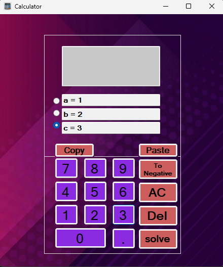

# 🧮 WinForms Calculator

A fully functional Windows Forms calculator built with C#, featuring standard arithmetic operations and a built-in quadratic equation solver.


---

## ✨ Features

### Standard Calculator
- Basic operations: Addition, Subtraction, Multiplication, Division, Modulo
- Operator precedence (× and ÷ before + and -)
- Decimal point support
- Division by zero protection
- Copy & Paste support
- Delete (backspace) and Clear (AC) buttons

### Quadratic Equation Solver
- Solves equations of the form **ax² + bx + c = 0**
- Handles all cases: two solutions, one solution, or no real solution
- Supports expressions as coefficients (e.g. `a = 3+2×5`)
- Copy & Paste support for coefficients

---

## 🧠 Technical Highlights

### Operator Precedence with Regex
The calculator correctly handles operator precedence without using `eval()` or any expression parser library. It uses `Regex.Split()` to tokenize the expression, processes `×`, `÷`, and `mod` first, then handles `+` and `-`:

```csharp
// Split by + and - first
string Pattern = @"(?=[+\-])";
var ScreenAfterSplit = Regex.Split(ScreenText, Pattern)...

// Then resolve × ÷ % within each segment
string pattern = @"([\×\÷\%])";
var ItemSplited = Regex.Split(Item, pattern)...
```

### Quadratic Equation Solver
Uses the standard discriminant formula:
```
Δ = b² - 4ac
x = (-b ± √Δ) / 2a
```

### Division by Zero
Detected at calculation time inside `UpdateOperation`:
```csharp
if (list[index + 1] == "0")
    throw new DivideByZeroException();
```
Caught cleanly by the `try/catch` in `btnEqual_Click`.

### Single Instance Window
The equation solver window is managed to prevent duplicate instances:
```csharp
if (_equationForm == null || _equationForm.IsDisposed)
    _equationForm = new frmSolveEquation(this);
```

---

## 🖥️ Screenshots

| Calculator | Equation Solver |
|---|---|
|  |  |

---

## 🚀 Getting Started

1. Clone the repository:
```bash
https://github.com/AbdEssamed-Laidani/WinForms-Calculator.git
```
2. Open `SimpleCalculator.sln` in **Visual Studio 2019+**
3. Build and run (`F5`)

> ⚠️ Requires **.NET Framework 4.7.2** or later and **Windows OS**

---

## 🛠️ Built With

- C# / .NET Framework
- Windows Forms (WinForms)
- System.Text.RegularExpressions

---

## 👤 Author

Built as part of my C# and WinForms learning journey.
